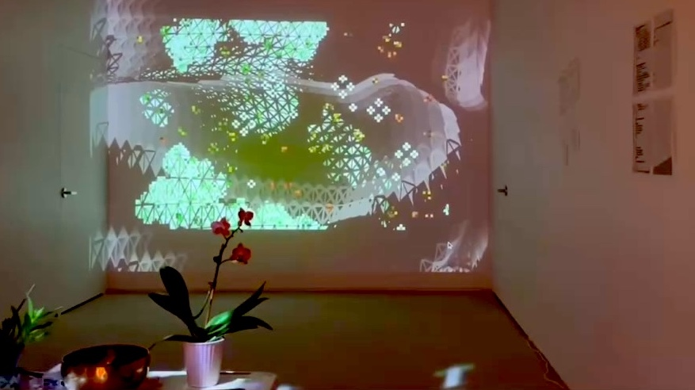
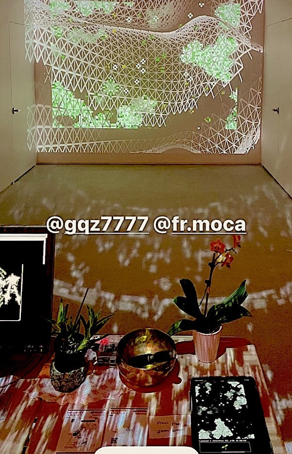

# * project created for the Plant/ED gallery exibition at Fall River Museum of Contemporary Art *

This program ran on the muesum's local network and allowed guest to interact with the exibit by "seeding" the game of life simulation. 
There was a host computer that ran the node server and displays a live feed/log of the simulation via the terminal. 
In addition, there is a hosted webpage that visualy displays the live simulation. Another computer connected to a projector within the exibit displayed this page. 
Guests were welcomed to use their phone to connect to a site which had a "plant seeds" button. Alternitivley they can press a numpad-keyboard covered in moss, and they were encourged to "touch grass"

I created this project as an entry point to interactive exibits, one that would require little to no maintence while the gallery was up (although I did contantly work to build and improve the project as long as i could)
Im greatful I had the opportunity to vist the gallery many times and continue interating and building upon the inital version.

There was no real "thesis" or "message" or "point" I was trying to explicity get across. 
the theme of 'plant-education' was perfectly suited for the work I was already doing. 
up to this point, all the visuals I coded were in some way aimed at trying to simulate the infinite beauty of nature with the compute power I could harness through coding. 
I simply aimed to create an intriguing, fun, and ideally meditative space; to use what I know, explore what I love, and learn as much as I could from the unique opportunity I was given.
I did learn quite a bit during this whole process, in more aspects than i inticipated. 

Something I found interesting about the game of life algorithm, is that when left on its own, with no interaction, eventually the simulation will reach a point of stasis. 
The simulation will be effectively inert and yet the simulation, the field, or 'earth' that the cells exist in would not be entirely dead. 
there would always be some stable structures left over. this is simply to do with the way the algorithm works. 
Its quite commonn that by happenstance, cells will fall into alignment with one another and keep eachother alive. In fact, its almost an impossible chance that all the cells would cancel out and all end up dead. 
I'll also say, when the simulation starts, and there are no cells living, it takes quite a bit to get them to self propigate. 
It takes a lot of inital energy so-to-speak to "enrich the soil", but once it is, its almost imposible to undo by chance. 

Even now, I dont aim to tell you what this means, or what importance this has in the greater world, but I think it is beautiful, and maybe that's enough 

-- g

-----------------------------------------------------------------------------------------------------------------------------------------------------------------------------

feel free to download and test this out project on your local network. just follow the following steps [here](https://github.com/qzpimae/life_socketio/tree/main/how-to-run)

if you would like to see where ive gone with my cellular automata journey, check out my latest game-of-life project. its a painting app! learn more about it [here](https://sacred-web.vercel.app/paint/about) 

